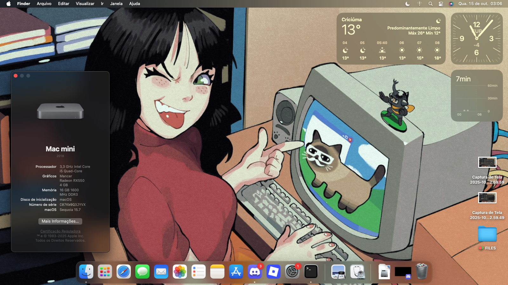

# EFI OpenCore Haswell + RX550 Lexa 4GB (Metal2, Full-support with DRM and Encoders).

The following versions are compatible with this EFI:  
`Catalina, Monterey, Ventura, Sonoma, Sequoia and finally Tahoe.`

__Build:__  
Mobo: Kingster H81 1150 DDR3  
CPU: Intel Core i5-4590 3.70GHz  
Ram: 16GB Dual-Channel Kingston DDR3 1600MHz  
Storage: 120GB SSD SATA  
GPU: AMD RX550 Lexa 4GB  

- [Tutorial](#tutorial)
- [Modifications](#modifications)
- [Important Links](#important-links)
- [Screenshot](#working-setup)

### Tutorial:

Open the terminal and type:  
**`diskutil list`** - this will list all your disks   
**`sudo diskutil mount /dev/yourdisk`** - this will mount your efi partition according to your disk (e.g. /dev/disk0s1)  
 After that, just delete the old EFI and move the new one to the partition, and you're done!  
You have a working Hackintosh Haswell with RX550 Lexa!
 

### Modifications:

__boot-args__:  

    -v alcid=1 watchdog=0 agdpmod=pikera dk.e1000=0 e1000=0 shikigva=80 unfairgva=1 -radcodec

__SMBIOS__:  
Has a Generic Serial (MacPro 2019) and you need to regenerate a new SMBIOS using [genSMBIOS](https://github.com/corpnewt/GenSMBIOS)</b>

__Kexts present__:  

    Lilu.kext 
    VirtualSMC.kext
    AppleALC.kext
    AtherosE2200Ethernet.kext
    IntelMausi.kext
    RealtekRTL8111.kext
    RestrictEvents.kext
    SMCProcessor.kext
    SMCSuperIO.kext
    USBInjectAll.kext
    WhateverGreen.kext

__PCI/GPU-Setup__:

    Key: AAPL,slot-name | Value: Internal@0,3,1/0,0/0,0/0,0 | Type: STRING
    Key: device-id | Value: FF670000 | Type: DATA
    Key: device_type | Value: VGA compatible controller | Type: STRING
    Key: hda-gfx | Value: onboard | Type: STRING
    Key: model | Value: Radeon RX550 | Type: STRING
    Key: no-gfx-spoof | Value: 01000000 | Type: DATA

__ACPI__:  
This EFI uses MaLd0n and Dortania SSDT's profiles  

    MaLd0n.aml
    SSDT-PLUG-DRTNIA.aml

### Important Links:  
<a href=https://olarila.com>Olarila</a> 
<a href=https://dortania.github.io>Dortania</a> 
<a href=https://github.com/corpnewt/GenSMBIOS>genSMBIOS</a>   
### Working Setup:  

